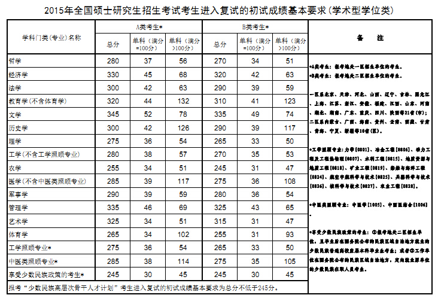
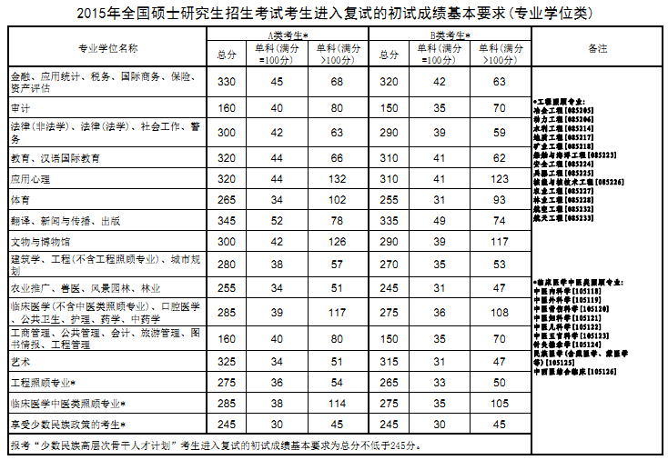

title: 报考院校选择以及复习规划
date: 2016-07-27 20:52:21
tags: [考研,考试面试]
---
好了！恭喜你！既然你有勇气点开这篇文章，就意味着你很有勇气。

<!-- more -->

## 报考院校选择策略
人往低处走，水往低处流。考研目标院校专业一般为比目前好的。考研类型根据选择的院校和专业分三种，跨省、跨校、跨专业。

**跨省**，即目标院校与当前院校不在同一个省份，地域距离较远，不利于初试，复试等情况，但很多人也借此机会考回家乡的省份，也是不错的选择。

**跨校**，即报考其他院校，一般为比当前院校资源、名声好的院校。比如普通院校想考个211，或者211的想考去985。难度在于目标院校老师对于外校学生能力的质疑，以及考生对目标院校的不理解不熟悉。

**跨专业**，即报考专业与目前在读专业不一样，这个难度在于准备专业课考试需要花点功夫，还有在复试时导师们对跨专业考生能力的质疑。

如果你要“三跨”，那就要花点功夫了，一个跨就是一个难。

**简单策略**：首先确定你需要报读的专业（大致的方向就行），之后选择目标院校（考虑院校在此专业方向的知名度、教授好不好等），还要考虑自己是报读学术型硕士或者专业型硕士（参考具体院校培养计划，学硕与专硕可能会有所不同），许多信息可以参考[研招网](http://yz.chsi.com.cn/)，或者具体院校的自己研招网（自行谷歌）

选择好这些之后，就可以去该院校的研招网上找到往年的研究生招生简章，里面有具体招生专业与人数，其中有一项是报考专业的初试要求，会列举出你所选专业考的是英语（英语一或者英语二）、数学（数学一，数学二，或者数学三），专业课考的是什么，参考书是哪本等等，一般来说每一年的研究生招生简章大同小异。

技巧策略（仅供参考）：比如小白目前是华南师大的光电专业的本科学生，他想考去华理工的计算机专业，这属于“两跨”，他可以先报名第一志愿去华工计算机专业，专业课考试题目也是华工计算机出的。假设小白过了国家线但是没有过华工的分数线（中大华工等全国有34所高校是自主划线的），那么他就没有资格参加华工计算机专业的研究生复试了，但是他可以调剂回本校的计算机专业（较为冷门，且招生不满的情况），当然如果小白进入得了复试并且顺利拿下研究生名额是最好不过了，这样就有后退路可走，不会浪费机会。

这里特别声明一点：**所有报考研究生的考生的初试都需要过国家分数线才能进入复试（除了及其个别的特殊学校），要不然是没有资格成为研究生的。**国家分数线分为两条，一条是单科线（分为科目满分100分的线以及科目满分大于100分的线），一条是总分线。初试分数这些线都要过才能称为过了国家线。

下附两张2015年国家分数线的表供大家参考

##  复习规划
在我第一篇考研系列文章“考研是什么？”里面提过，复习是越早越好。总的来说，**复习靠的是坚持！坚持到底！**

在上面说的，确定好目标院校专业的所需的初试考卷信息，就能确定复习所用的教材。

**政治**：在暑假的时候全面梳理一次“四件套”（近代史、思修与法基、马克思、毛中特）的选择题知识点骨干，多做多练选择题，对各部分知识形成框架理念。

最后一个月，买几套“时政”题目（选择题多选题）来做一下，并且做好复习笔记。毕竟“时政”的题目只有背，没有任何逻辑可言。最后冲刺把肖秀荣四套卷的大题答案给背了吧，再稳妥一点就把网上几个主流政治预测高手的压卷给背一下，拿下70应该就没有问题了。

**英语**： 英语的积累没有捷径，在考研英语词汇方面，还是需要花点功夫的。个人主张多做多读类似真题的阅读文章，这样记忆会比较牢固，单词书还是不适合我。

长难句的阅读也是难点，也是阅读的重点，凡是阅读文章中的长难句，也是题目的答案线索所在地。

英语完形填空利用红花绿叶规则以及ABCD概率相等原则来利用最少的时间得到最高的分数；

英语考试有两篇作文，小作文是书信或者通知，都有固定的格式以及书写套路，到时候收集几篇范文即可；大作文注重理论逻辑清晰，总分总结构大家肯定很熟悉，这与四六级的大作文相差无异。噢对了，学会炫技——长难句的书写，能够更好地为作文加分。

**数学**：数学一的考试范围最广，高等数学（无穷级数等）、线性代数、概率论，物理应用都要考；数学二的考试范围最窄，紧紧考高等数学以及线性代数，物理应用即可；数学三为经济类学生考卷，三本书都要考，外加经济类题目。

数学是考研之重头戏，几乎百分之70以上复习时间都在这里，150分的分量足以说明。多做题，多做题，多做题，切勿眼高手低，动手算才是自己的。

**专业课**：根据招生简章的要求准备专业课，专业课也是重要的一科，这关系到导师选取考生的重要标准。专业课千千万万，总结一点就是多做往年真题，总会捡到宝的。还有，专业课是目标院校自主出题，可以找找关系辅导一下，还有划一下书什么的，性价比高！

最后一个问题，考研到底要不要报班？名目众多，报什么班好？

我的回答，需要。稳健起见，毕竟考研都是想一次过的，报一个普通的班性价比比较高，面授课课间可以主动去与老师交流一下，也是很好的体验。

最后祝大家万事如意！至于这个系列之后更不更，看心情。
